# Genshin Impact Character Shader Breakdown [Unity URP]

By [Adrian Mendez](https://www.artstation.com/adrianmendez). Original post: [ArtStation](https://www.artstation.com/artwork/wJZ4Gg).

I love Genshin Impact art style so I decided to study how the character shader is made, I used Unity URP.

Here's a little breakdown that I wanted to share with the community.

The characters and textures are from Hoyoverse company, you can officially download the models here:

[https://genshin.hoyoverse.com/ja/news/detail/5885](https://genshin.hoyoverse.com/ja/news/detail/5885)

In my case I am using the models only for educational purposes.

Shader features:

- Custom ligthing for cel shading (support multiple lights, cast shadow).
- Outer shadow.
- Anisotropic hair.
- Face shadow tweak.
- Metallic.
- Outline.
- Special Face Outline.
- Edge Highlight.
- Custom tonemapper.
- Dithering.
- Fog.

[Watch the video on YouTube](https://www.youtube.com/watch?v=WR_SP4LmOlw)

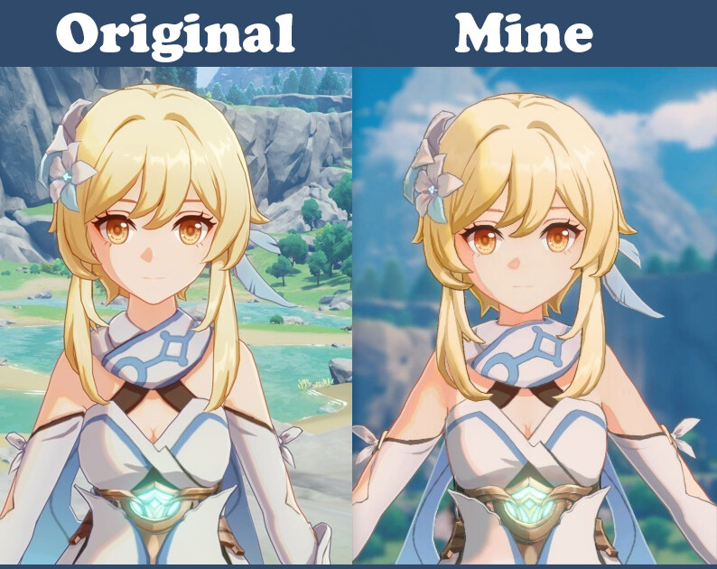

*Lumine rendered in the original game (left) and with the recreated Unity URP character shader (right).*

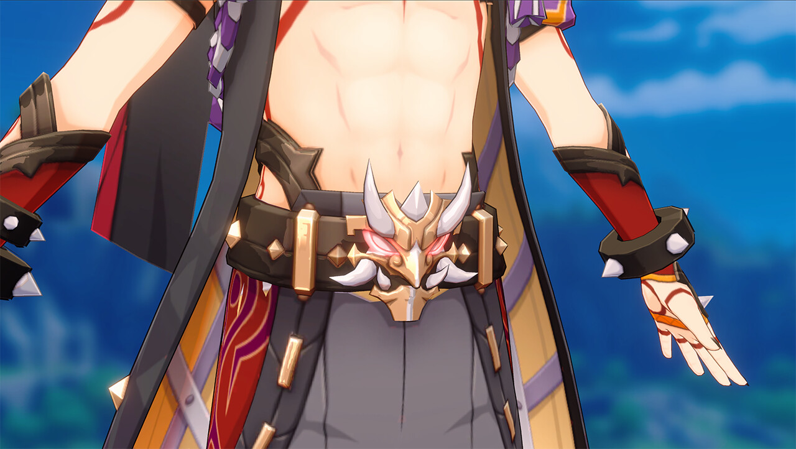

*Close-up of Arataki Itto's belt: the metallic mask gives the gold buckle and studs sharp, view-dependent highlights.*

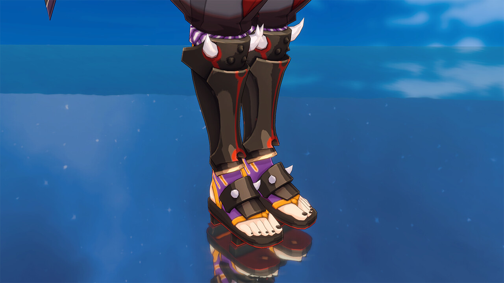

*Itto's sandals and shin guards, showing dark cel-shaded materials, red outline accents, metallic ankle bands, and the floor reflection.*

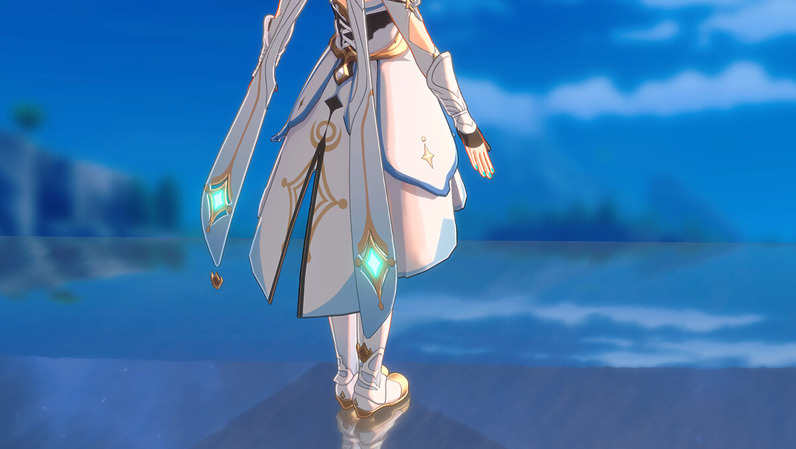

*Lumine's lower costume in the final shader, with cyan emissive ornaments, colored outlines, soft fog, and a reflective floor.*

## Custom Lighting

First, do a simple NdotL (NdotL is the dot product between the normal and the light direction).

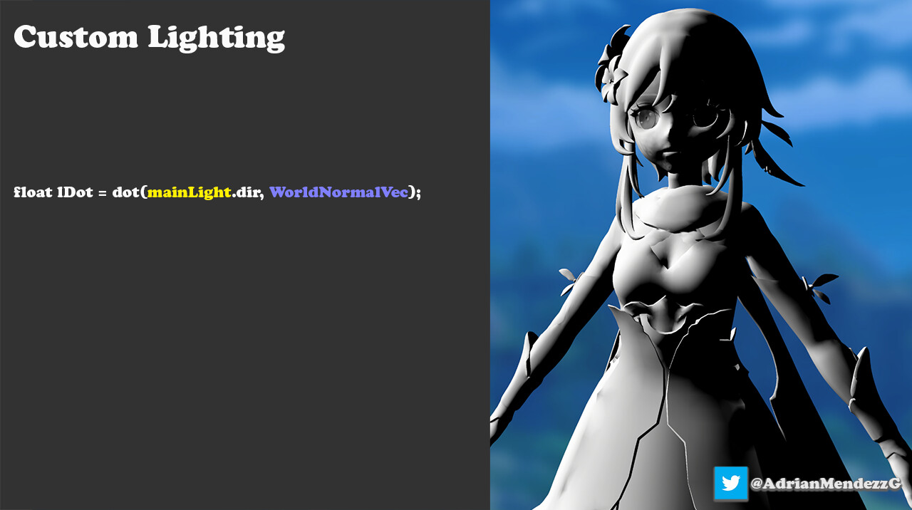

*Raw diffuse lighting from `float lDot = dot(mainLight.dir, WorldNormalVec);`, producing a continuous grayscale NdotL gradient.*

The most important thing in Cel shading style is the transition between light and shadow, in Genshin Impact they not do an extreme hardness so 0.1 should be enough.

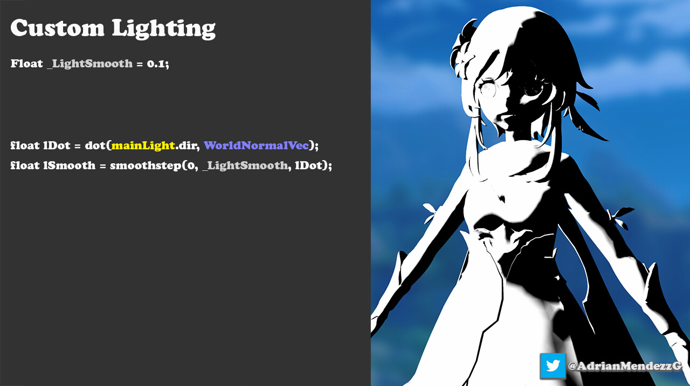

*With `_LightSmooth = 0.1`, `smoothstep(0, _LightSmooth, lDot)` converts the gradient into two cel-shaded regions with a narrow, softened transition.*

Do a lerp with the previous result to tint the shadow and the light to have more color control.

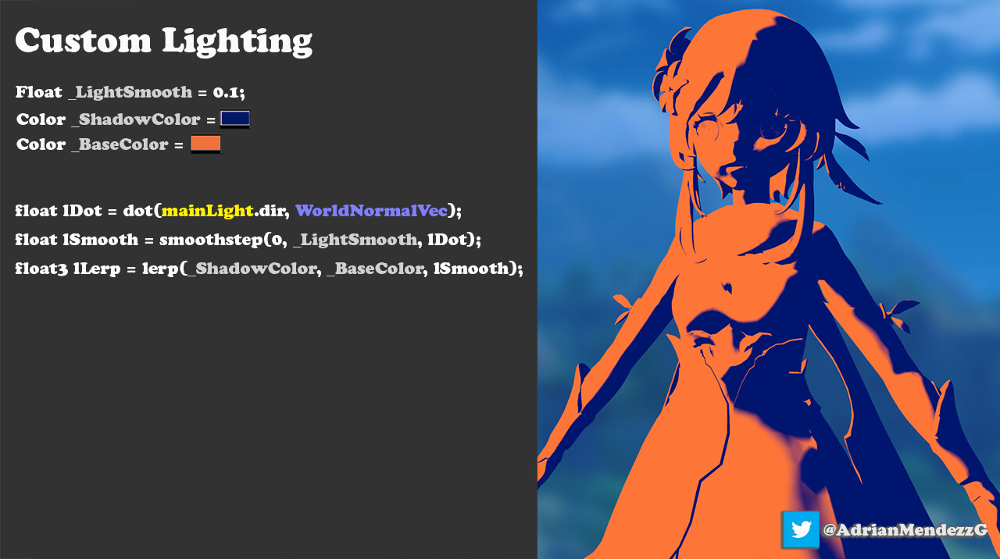

*`lerp(_ShadowColor, _BaseColor, lSmooth)` maps the two lighting regions to independently adjustable blue shadow and orange light colors.*

Multiply the result by the base texture.

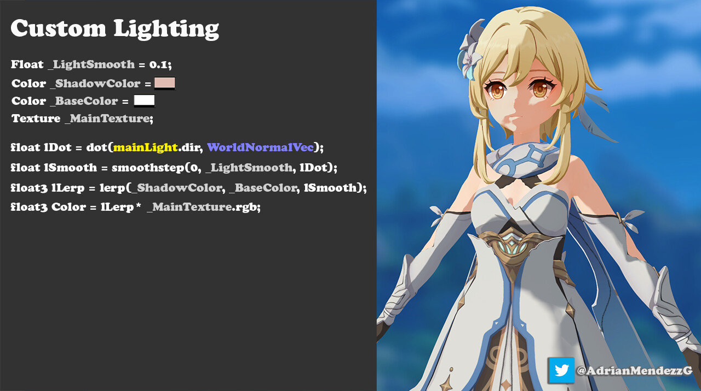

*The final lighting color is calculated with `float3 Color = lLerp * _MainTexture.rgb`, restoring Lumine's texture detail while preserving the cel-shadow split.*

## Outer shadow

Genshin impact adds an outer extra small shadow with a different color. Do another NdotL but this time offset it a bit and make the transition harder, tint it with a similar color.

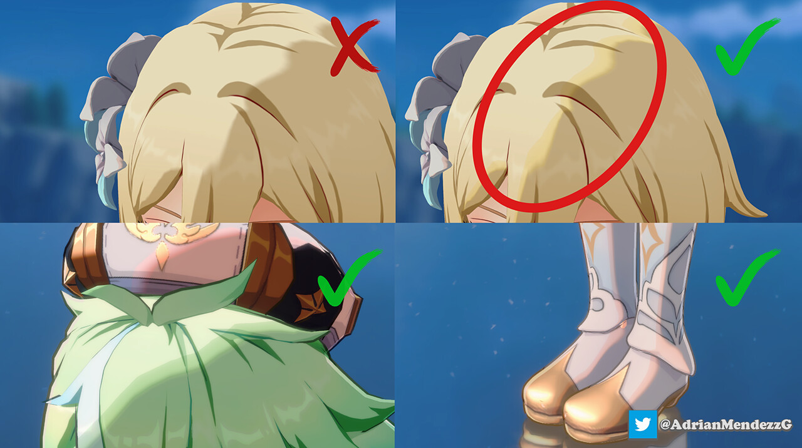

*The correct result adds a narrow, warm secondary shadow band inside the main hair, clothing, and footwear shadows; the flat hair result at upper left omits it.*

## Anisotropic Hair

Hair shines only when it receives light and you can also remove the sides with fresnel for a better result.

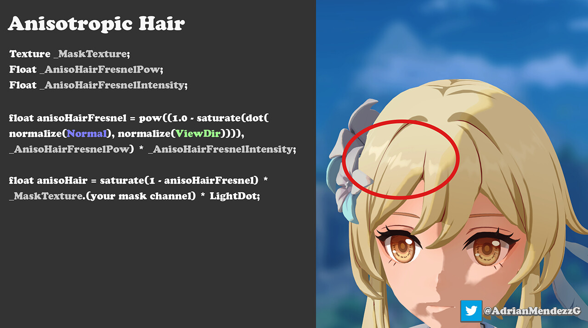

*The circled hair streak is isolated with a texture mask and `LightDot`; a Fresnel term built with `pow`, `dot(Normal, ViewDir)`, and `saturate` suppresses the highlight toward the silhouette.*

## Face Shadow

A simple NdotL is not the best option for cel shading artstyle, especially for the face. Depending on the direction of the light the result can be ugly.

We can edit the normals direction to avoid bad results, but there is a better option.

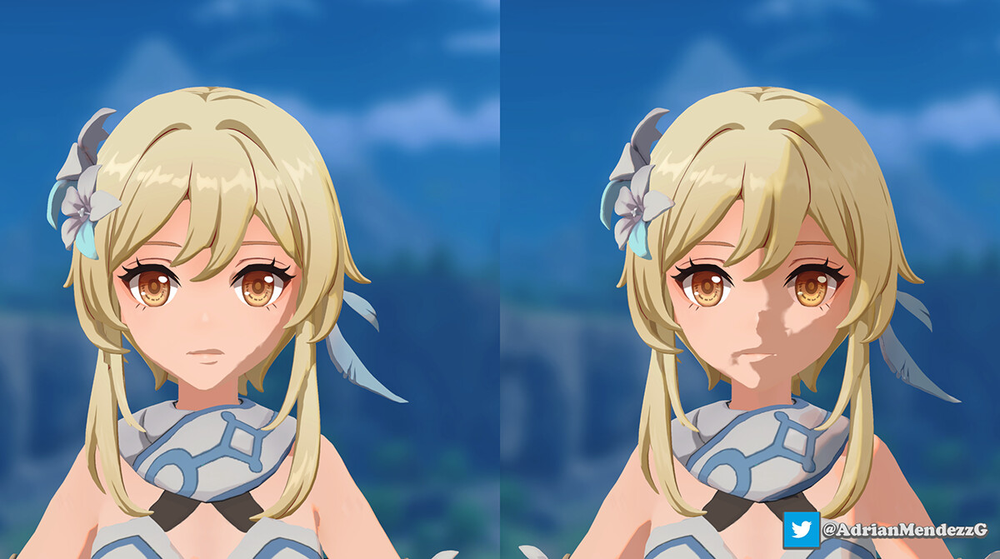

*A basic NdotL can jump from an evenly lit face (left) to a harsh, anatomically unflattering shadow across Lumine's nose and mouth (right).*

With this texture we can modify the shadow shape:

- Channel R will be for degrees 0 to 180.
- Channel G will be for degrees 180 to 360.

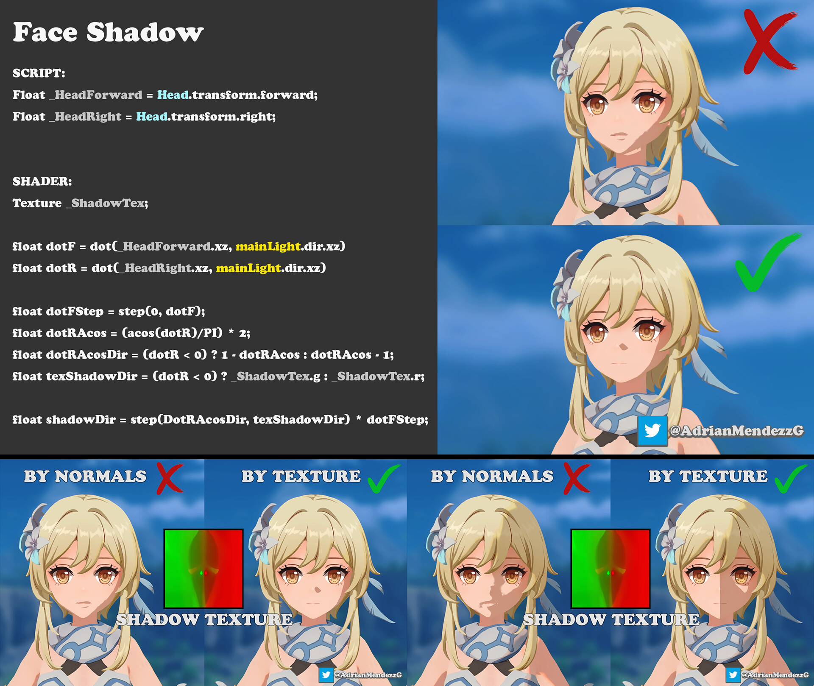

*Texture-driven face shading: script-provided `Head.transform.forward` and `.right` vectors are dotted with `mainLight.dir.xz`; `acos`, `step`, and the R/G channels of `_ShadowTex` then select a stable shadow shape for either light direction.*

## Metallic

The metallic parts looks like a kind of blend between diffuse texture and matcap. So, make a Matcap should be enough, but I did something similar and simple.

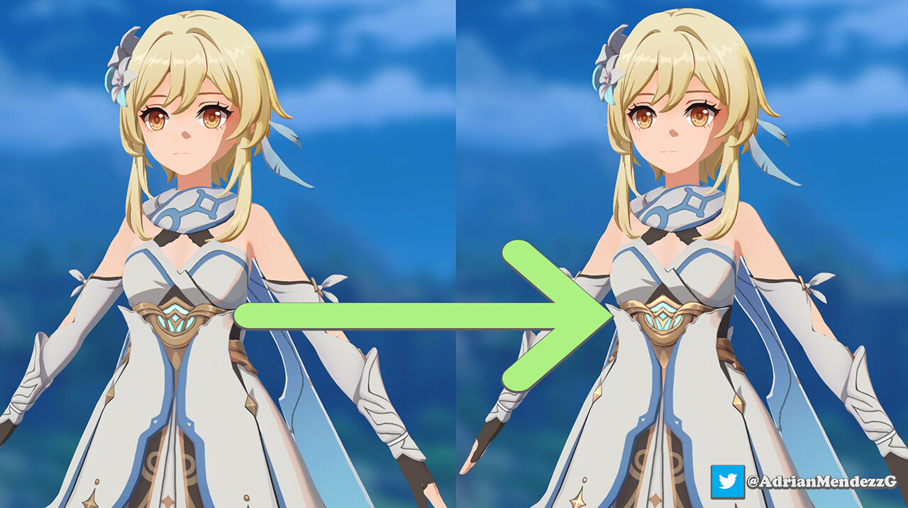

*Before and after the metallic pass: Lumine's gold waist ornament gains a bright directional band and stronger contrast.*

1. Use a Gradient Texture with the desired colors to tint your metal and do a DOT between Normal Vector and View Direction + Light Direction to do the UVs.
2. Distort the Gradient Texture UVs with a normal map if necessary.

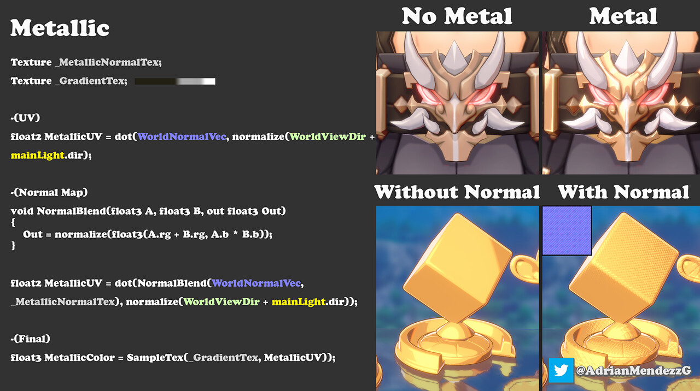

*Metallic implementation and comparisons: `MetallicUV` comes from `dot(WorldNormalVec, normalize(WorldViewDir + mainLight.dir))`, optionally using `NormalBlend` with `_MetallicNormalTex`; `SampleTex(_GradientTex, MetallicUV)` supplies the final metal color.*

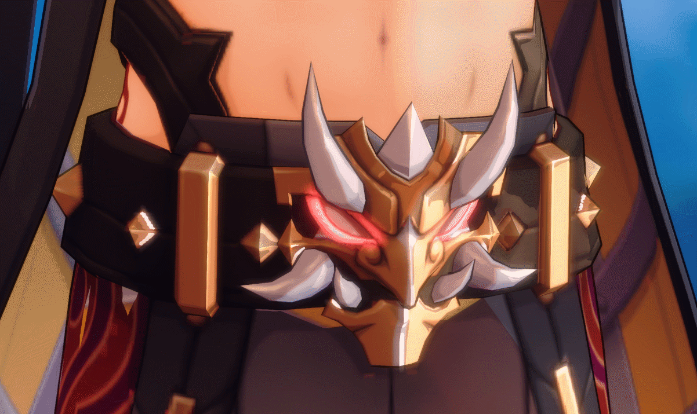

*Animated view-dependent metallic band sweeping across Itto's gold oni belt buckle and studs.*

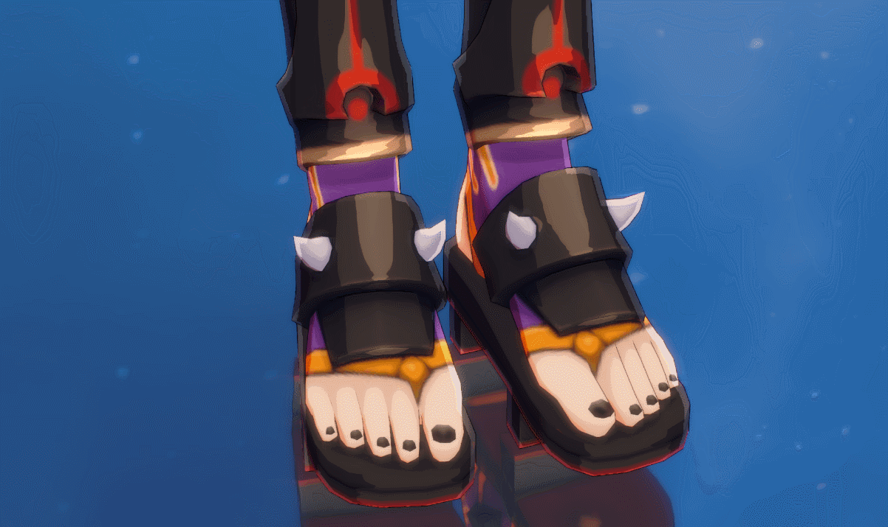

*Animated metallic response moving over Itto's dark shin and sandal plates, with a brighter band on the ankle trim.*

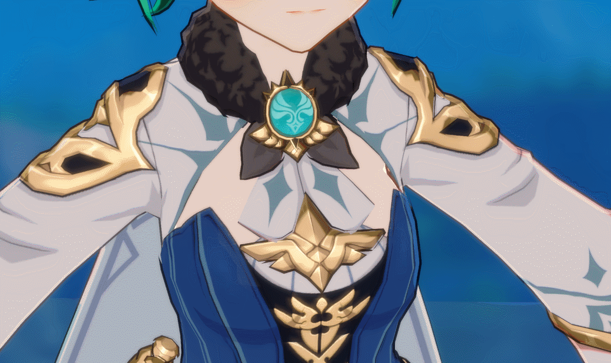

*Animated metallic bands traveling across Sucrose's gold brooch, shoulder pieces, and chest ornament.*

### Metallic with Normal Map

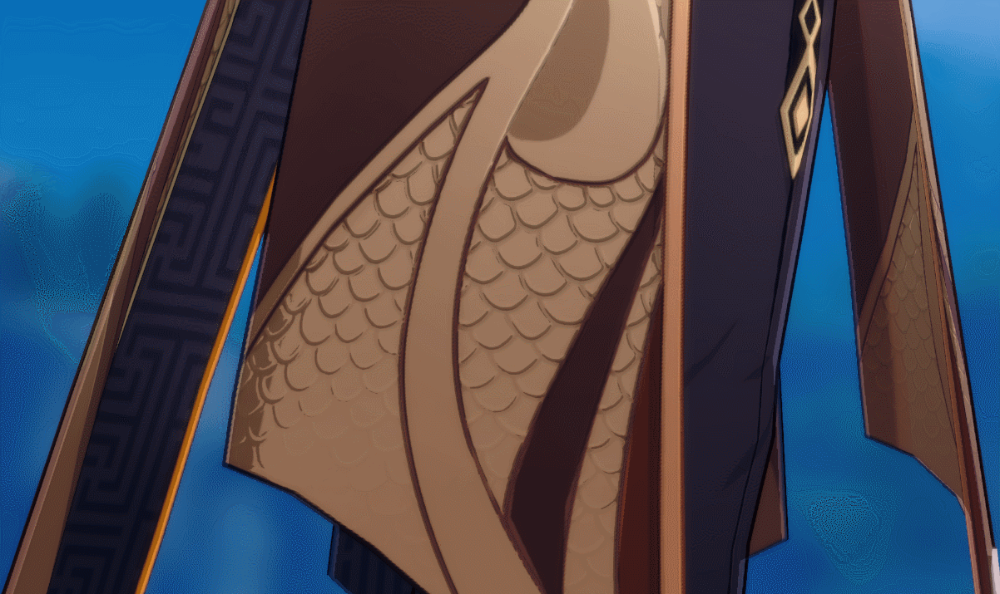

*A metallic normal map distorts the moving highlight into the repeating scale pattern woven into the fabric.*

## Light & Fog

Finally multiply the final result by the color light and fog. The character shader is finished. Let's move to postprocess.

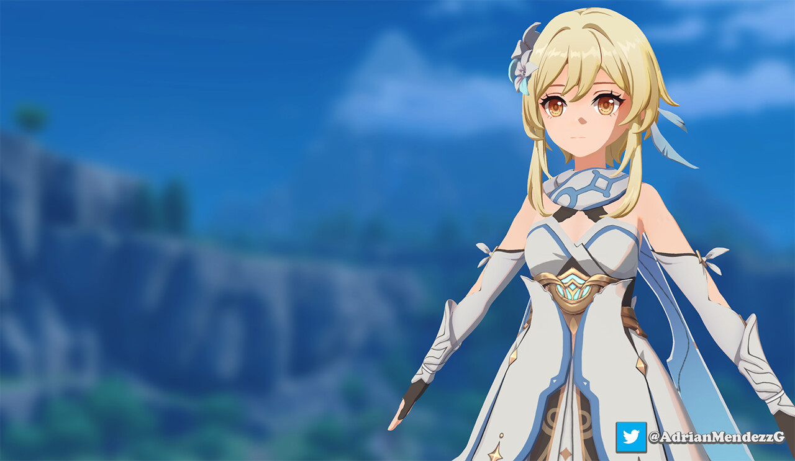

*Completed Lumine shader after multiplying the material result by the scene light color and blending it into the blue atmospheric fog.*

## Outline

Outline postprocess is better since the traditional method: duplicate, scale and flip the mesh... is less precise.

For custom postprocess we need the blit render feature, I used this:

[https://github.com/Cyanilux/URP_BlitRenderFeature](https://github.com/Cyanilux/URP_BlitRenderFeature)

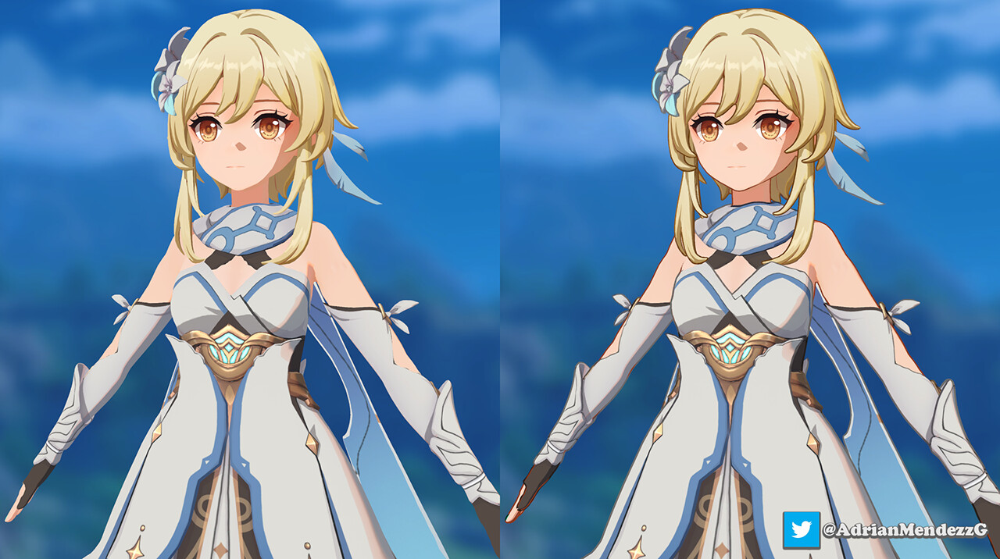

*Outline disabled (left) and enabled (right), where dark contour lines sharpen Lumine's silhouette and internal costume boundaries.*

1. Detect the edges using the Depth Scene Texture And the Normal Scene Texture to do the same.
2. Combine both results for maximum edge coverage.

More info on this article:

[https://roystan.net/articles/outline-shader.html](https://roystan.net/articles/outline-shader.html)

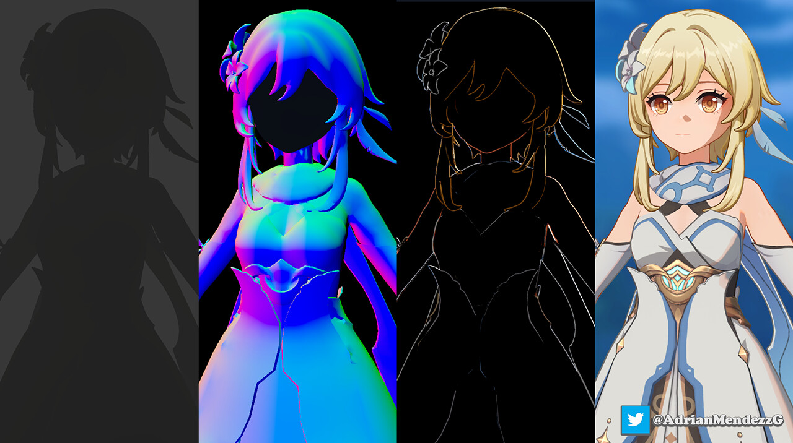

*Four-stage outline pipeline, from left to right: scene depth, world-space normals, combined detected edges, and the outlined color render.*

### Outline Face

To avoid unwanted outlines in places like the face, the depth value is manipulated to make it difficult to appear.

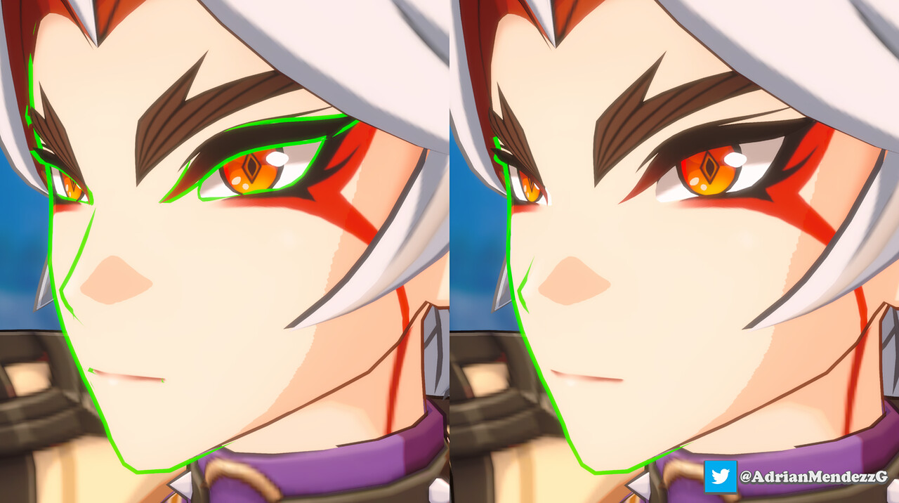

*Before (left), green marks expose unwanted edges around Itto's eyes, nose, and mouth; after depth adjustment (right), only the outer facial contour remains.*

## Edge Highlight

Genshin Impact it has a white outline around the character like in most Animes.

This IS NOT A FRESNEL.

Is a post-process that reads the character silhouette and detect the edges with sobel filter to add them to the final image.

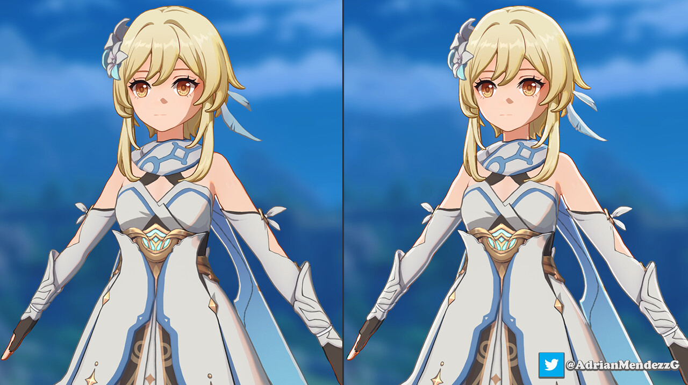

*Edge highlight disabled (left) and enabled (right); the effect adds a thin white rim along the lit side of Lumine's silhouette.*

Read the depth scene texture then detect the edges with Sobel filter. The outline will be inserted on the side with the value of greater depth.

Finally, move the edge highlight down a bit.

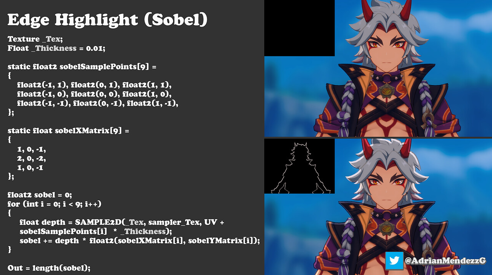

*Sobel depth-edge pass: nine UV offsets sample `_Tex` using `_Thickness`; the `sobelXMatrix` and `sobelYMatrix` kernels accumulate depth gradients, and `length(sobel)` returns the silhouette mask before it is offset and composited.*

## Postprocess Tonemapper

Unity URP has 2 tonemappers without adjustable parameters:

- Neutral: Maintains color saturation but we will continue to have inadequate light in the most bright areas.
- Aces: Fixes bright areas but contrasts and desaturates colors.

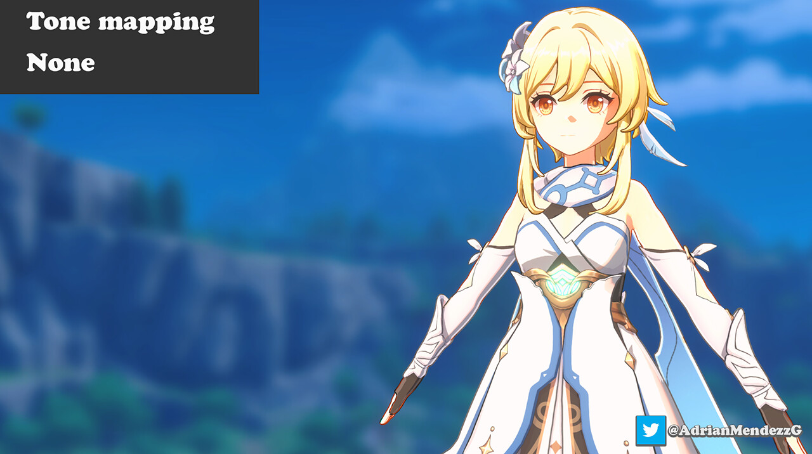

*With tone mapping disabled, Lumine's hair, skin, and white clothing clip toward white and lose highlight detail.*

Neutral would be the best option, but it would be better to write a custom tonemapper.

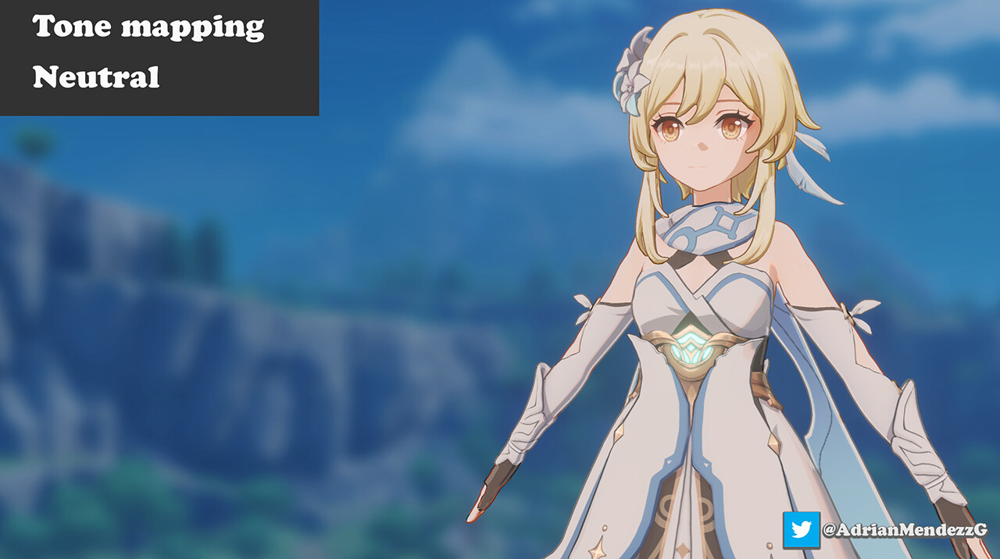

*Unity's Neutral tone mapper recovers highlight detail but produces a flatter, more muted rendering.*

I used Gran Turismo tonemapper ([https://www.desmos.com/calculator/gslcdxvipg?lang=es](https://www.desmos.com/calculator/gslcdxvipg?lang=es)) Since it keeps the color saturation and fixes burned areas. This would be ideal for cartoon style.

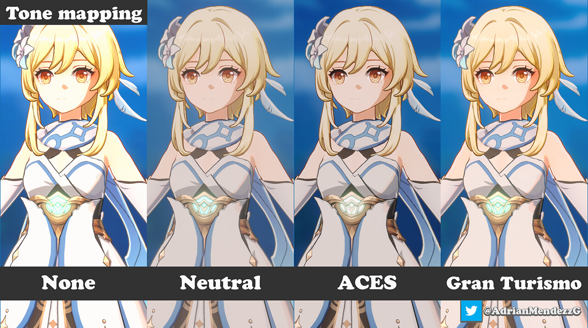

*Side-by-side tone-mapping comparison: None is overexposed, Neutral is muted, ACES adds contrast but desaturates, and Gran Turismo retains brighter cartoon colors while controlling highlights.*

## Glasses Effect

I added a parallax effect for Sucrose's glasses, this is not used in the original but I added it as an extra.

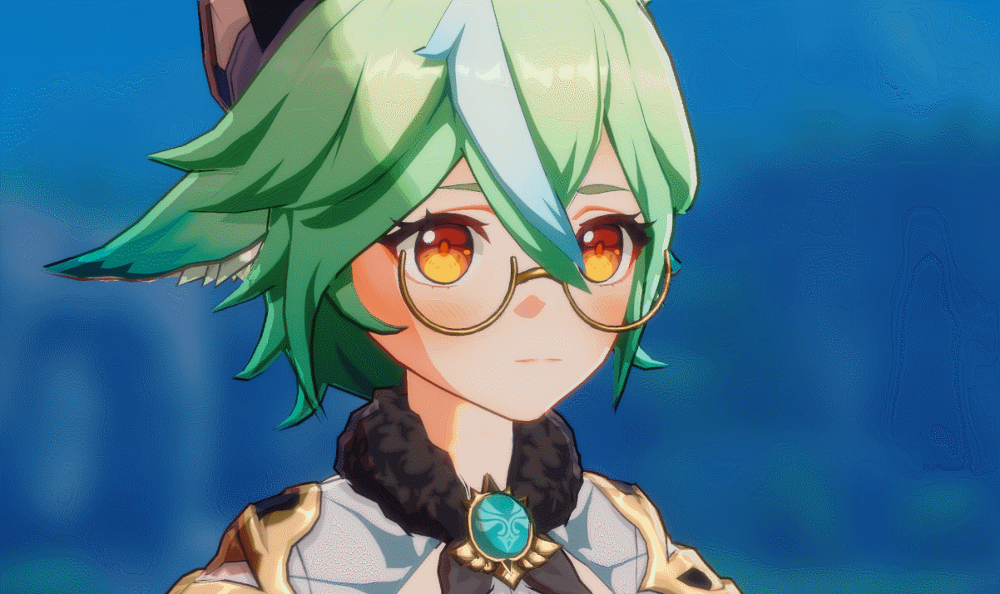

*Animated parallax in Sucrose's lenses shifts the enlarged eye detail relative to her face as the viewing angle changes.*
