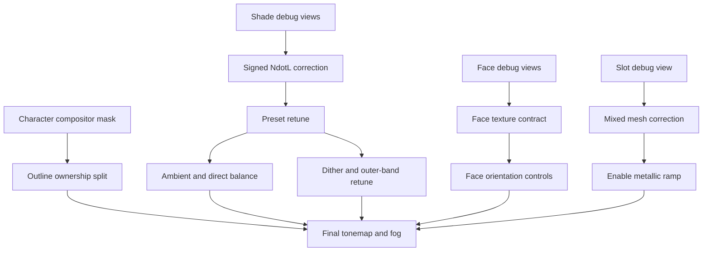

# Prioritized improvement roadmap

## Goal

Move the Godot result toward a Genshin-like character image while preserving useful Godot-native architecture. This is not a request to clone every implementation detail of the minimal URP shader.

Each stage should produce an isolated capture before the next stage changes the look.

## P0 — correctness

### P0.1 Restore a valid signed lighting domain

Problem: negative `N·L` values are clamped away, and active hair/cloth thresholds equal their minimum wrapped values.

Change:

```text
raw_ndl = dot(NORMAL, LIGHT)
wrapped_ndl = mix(raw_ndl, 1, light_wrap)
shade = smoothstep(threshold - softness,
                   threshold + softness,
                   wrapped_ndl)
```

Then retune all preset thresholds. Do not preserve old numeric values merely to preserve the old image; the old values encode the defect.

Acceptance criteria:

- back-facing hair and cloth can reach `shade <= 0.05`;
- the visible terminator remains stable during a 360° turntable;
- metal does not remain fully lit when facing away from the key light;
- dither is temporarily disabled during validation.

Risk: the corrected model will initially look darker. Fix ambient balance after proving the shade signal, not in the same change.

### P0.2 Repair and verify the face-map contract

Problem: the active R and G channels are effectively identical.

Choose one path:

- packed R/G with meaningfully different channels; or
- single-channel map plus mirrored UV, matching the local URP reference.

Acceptance criteria:

- automated channel check confirms nontrivial R/G difference if packed;
- debug output clearly changes selected side at opposite light yaw;
- close-up captures at -90° and +90° show mirrored or independently authored cheek behavior;
- no reliance on the current full-body A/B pair.

Risk: Godot may retain an old imported texture. Delete/reimport only as part of the implementation task and verify the runtime resource, not just the source PNG.

### P0.3 Add diagnostic shader views

Add temporary or permanent debug modes for:

- signed `N·L`;
- wrapped `N·L`;
- final `shade`;
- cast-shadow term;
- face selected channel;
- face angular threshold;
- slot/material ID.

Acceptance criteria: each view has a documented expected range and can be captured by the screenshot harness.

This avoids tuning several mixed effects from final color alone.

## P1 — high visual impact

### P1.1 Rebalance indirect and direct lighting

After P0.1:

1. capture with ambient emission set to zero;
2. restore only enough ambient to prevent crushed black regions;
3. compare additive ambient with a URP-like indirect floor;
4. retain one directional key during tuning.

Preferred target:

- clear lit and shadow families;
- cast shadows use the material's shadow tint;
- ambient does not lift the shadow family toward the lit family;
- white clothing retains color without clipping under the grade.

Do not add a fill light to repair a shader composition issue.

### P1.2 Separate outline ownership

Create three controlled modes:

1. hull only;
2. compositor only;
3. combined.

Use them to assign responsibilities:

- hull: locally colored outer silhouette;
- compositor: selected inter-mesh depth edges and white far-side highlight;
- face mask: suppress unwanted internal face edges.

Acceptance criteria:

- no ground-horizon line in character-only mode;
- combined silhouette is not wider/darker merely because two systems overlap;
- face and weapon behavior is deliberate rather than a side effect of disabling hull;
- the far-side highlight is visible at gameplay distance.

### P1.3 Add a character mask to the compositor

Possible implementations:

- dedicated render layer/mask viewport;
- stencil or material ID if accessible in the selected Godot pipeline;
- auxiliary low-cost character silhouette texture.

The mask should gate both dark outline and white highlight. If environment lines are desired later, they should have separate settings.

Risk: an extra pass has bandwidth and synchronization cost. Measure it at target resolution.

### P1.4 Isolate and enable metallic ramp

First ensure only true metal surfaces resolve to the metal slot. Then enable `UseMetallicGradient` and disable or reduce the competing Phong lobe.

Acceptance criteria:

- gold shows a moving colored band over a turntable;
- the band does not appear on hair or cloth;
- shadow-side gating remains deliberate after the P0 shade correction;
- weapon can use a separate preset if its blade should not share ornament behavior.

### P1.5 Improve face orientation controls

Add per-character:

- yaw offset;
- optional forward flip;
- optional channel swap;
- a head-bone target for animated characters.

Retain the current world-space axes design. Replace `head_position` unless a future effect actually needs it.

### P1.6 Resolve mixed mesh slot matching

Add an explicit slot for `Hair_Accs` after inspecting the surface. Longer term, prefer imported material metadata or explicit per-surface overrides over broad name wildcards.

Acceptance criteria: a debug material-ID view proves every surface receives the intended preset and extra maps.

## P2 — polish and robustness

### P2.1 Author production-quality maps

Replace heuristic face and hair maps with authored or appropriately sourced data:

- directional face threshold map;
- hair highlight/lightmap;
- packed control map for specular and metallic isolation;
- optional outline-width/depth mask.

Record provenance, channel meaning, color space, and fallback behavior beside each asset.

### P2.2 Add outline normals or width data

For meshes with split normals or pointed geometry:

- bake smooth outline normals into vertex color, UV, or a custom attribute;
- use vertex color to vary width around face, fingers, accessories, and cloth;
- keep lighting normals unchanged.

This avoids the URP sample's compromise of globally smoothing normals.

### P2.3 Decide alpha and culling per slot

Copy source alpha mode or expose explicit slot controls:

- opaque single-sided;
- opaque double-sided;
- alpha scissor double-sided;
- specialized transparent pass only where unavoidable.

Prefer fixed-function culling variants over per-fragment backface discard for production.

### P2.4 Stabilize texture sampling

Evaluate motion at multiple distances:

- reduce negative albedo LOD bias if linework shimmers;
- consider controlled mips for face/hair data;
- retain anisotropic filtering where it helps oblique cloth;
- compare MSAA-only against MSAA+FXAA for line softness.

### P2.5 Refine tonemap and fog last

Filmic plus saturation is a reasonable baseline. A Gran Turismo-style compositor should only be added after:

- lighting bands are corrected;
- metal and hair highlights are active;
- outline ownership is stable;
- bright colors and whites can be evaluated meaningfully.

Fog should not be increased globally merely to imitate a character plate. Consider a character-specific grade if atmospheric wrap is desired.

### P2.6 Remove dead configuration and documentation drift

Either implement or remove/mark:

- `outline_depth_flatten`;
- `head_position`;
- `NormalThreshold`;
- `use_control_tex`;
- `use_detail_normal`.

Synchronize README claims with serialized values for outline scale, exposure, and glow.

## Suggested implementation slices

Each slice should leave the demo runnable and produce evidence:

1. Add debug views and capture current shade/face inputs.
2. Fix signed `N·L`; leave ambient and presets otherwise unchanged.
3. Retune hair, cloth, face fallback, metal, and weapon thresholds.
4. Rebalance ambient/direct composition.
5. Repair face map data contract and reimport it.
6. Add face orientation controls and close-up yaw sweep.
7. Add slot-ID diagnostics and resolve `Hair_Accs`.
8. Enable metallic ramp on isolated metal.
9. Add compositor character mask.
10. Split hull/compositor ownership and tune highlight.
11. Revalidate dither and outer shadow.
12. Author higher-quality maps and outline data.
13. Tune tonemap, fog, LOD, and AA.
14. Remove dead properties and update general project documentation.

## Dependencies



## Stop conditions

Do not proceed to final grading while any is true:

- standard back-facing surfaces cannot reach full shadow;
- face R/G selection is not measurable;
- material slot assignment is unknown;
- compositor outlines unrelated scene geometry in character-only mode;
- metallic ramp is being judged on a mixed hair/metal surface;
- captures are too wide to show the feature under review.
